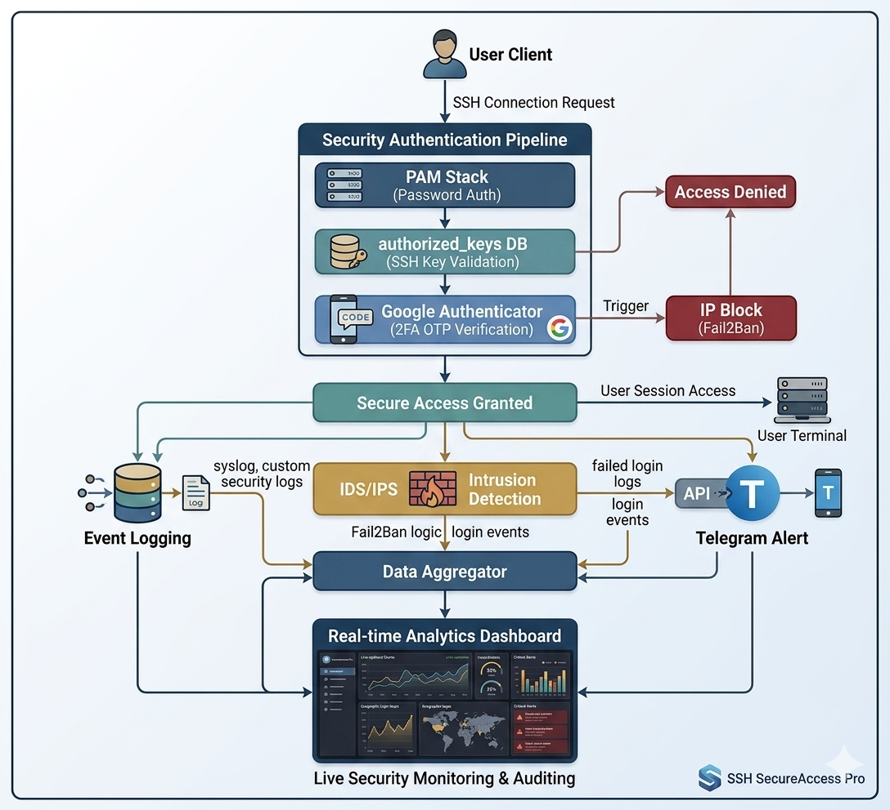

# 🔐 Secure SSH: 2FA / Multi-layer Ubuntu Authentication & Intrusion Detection

A complete multi-layer SSH security framework for Ubuntu servers.

## Features
- ✅ SSH hardening (key-only auth, no root login)
- ✅ Google Authenticator 2FA (TOTP)
- ✅ Fail2Ban brute force protection
- ✅ Telegram real-time login alerts
- ✅ Login event logger (Python)
- ✅ Analytics dashboard (terminal)

## Scripts
| File | Purpose |
|---|---|
| `scripts/ssh_dashboard.sh` | Terminal analytics dashboard |
| `scripts/ssh_logger.py` | Logs all SSH login events |
| `scripts/ssh_telegram_alert.sh` | Sends Telegram alerts on login |
## System Architecture

## Author
**Mikhaynu Marma** — [@miky0020](https://github.com/miky0020)
